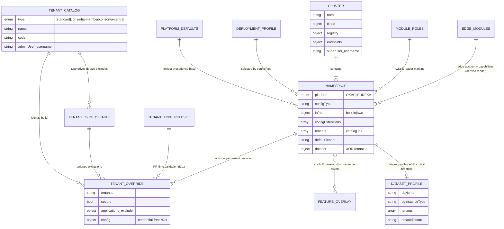
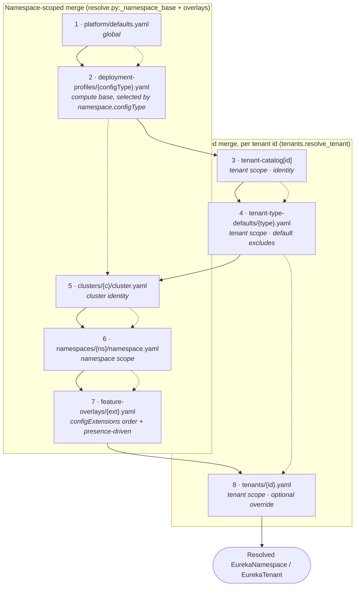
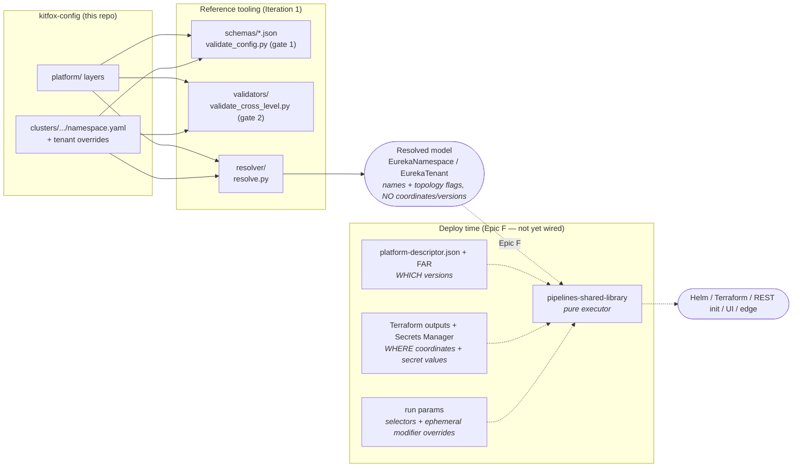
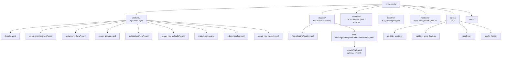

# Architecture overview

How `kitfox-config` is shaped and why it resolves the way it does. This distills
`design-artifacts/B-Trigger-Map/kitfox-config-schema-architecture.md` (cited as “§N”); for
the *why* behind each load-bearing choice see the [ADR log](decisions/).

## Design in one paragraph

`kitfox-config` is the desired-state for FOLIO deployments, expressed as declarative YAML.
The directory tree **is** the deployment hierarchy — `cluster → namespace → tenant` maps 1:1
onto folders, so discovery is `readdir`, not parsing. Shared, repo-wide policy lives once in
`platform/`; per-environment specifics live under `clusters/`. A namespace is resolved by
deep-merging eight precedence layers into a single model that the deployment pipeline
consumes. Six principles constrain every field (§0):

| Principle | What it means here |
|-----------|--------------------|
| **Config-as-data** | Feature behavior is a declarative overlay, not pipeline code ([ADR-0002](decisions/0002-config-as-data-overlays.md)) |
| **Credential-free** | Every secret is a `*Ref` or convention-derived — no plaintext ([ADR-0006](decisions/0006-credential-free.md)) |
| **KISS / one concept per entity** | No field mirrored across levels; the cluster is pure infra identity ([ADR-0003](decisions/0003-kiss-one-concept-per-entity.md)) |
| **Topology, not coordinates** | `built-in`/`aws` flags in config; hosts/ports from Terraform at deploy |
| **Names, not versions** | App/module names in config; versions from `platform-descriptor.json` via FAR |
| **Minimal redundancy** | A value is stated once at the highest applicable level; lower levels state only overrides |

Everything is schema-validatable, and the rules JSON Schema can't express within one file
are enforced by [cross-level validators](../validator-reference.md) at PR time.

## The cluster → namespace → tenant model

Three nested scopes, plus a repo-wide `platform/` layer that all of them draw on.

- **Cluster** (`clusters/<c>/cluster.yaml`) — pure **infrastructure identity**: cloud
  region/VPC, ECR registry, root DNS, the shared pre-provisioned endpoints (OpenSearch,
  Eureka registry, Rancher API, FAR), and the supertenant username. It deliberately does
  **not** carry `platform` or `configType` — those are per-namespace
  ([ADR-0003](decisions/0003-kiss-one-concept-per-entity.md), §2.5).
- **Namespace** (`clusters/<c>/namespaces/<ns>/namespace.yaml`) — a deployment environment.
  Owns `platform` (OKAPI/EUREKA), `configType`, topology overrides, feature flags, overlays,
  app exclusions, member teams, lifecycle, operational modifier defaults, and its tenant set.
  Covers the bulk of the legacy `CreateNamespaceParameters` (§2.6).
- **Tenant** — a FOLIO tenant. Its **identity** (type, name, code, admin username) lives once
  in `platform/tenant-catalog.yaml`; the namespace references it by id. A per-namespace
  `tenants/<id>.yaml` override exists **only** when the tenant deviates (§2.4, §2.7).

The `platform/` layer is the home for everything previously hardcoded globally that is *not*
cluster-specific: global defaults, deployment profiles (compute by `configType`), feature
overlays, the tenant catalog, dataset profiles, per-type default exclusions, module-role
lists, edge module config, and the tenant-type ruleset.

## Diagram (a) — Entity relationships

## Diagram (b) — The 8-layer resolution / merge order

A resolved namespace is computed by deep-merging these layers **lowest → highest
precedence**; later layers win key-by-key (§3). The selector for layer 2 (`configType`) is
read from the namespace — selection key ≠ precedence.

**Merge semantics** (§3, implemented in `resolver/merge.py` + `resolver/excludes.py`):

| Construct | Rule |
|-----------|------|
| Scalars / maps | Deep merge; the higher layer replaces the key |
| Named lists (`members`) | **Replace** wholesale — no implicit concatenation |
| `applications.exclude` | **UNION** across layers 4, 6, 8 — exclusions only accumulate, never silently un-exclude |
| `configExtensions` overlays | Merge in list order; a later overlay overrides an earlier one |
| Available app set | Not stored — computed: full descriptor list − unioned excludes |
| Secret `*Ref`s | Pass through untouched, never merged into values |

See [resolver-reference.md](../resolver-reference.md) for the full engine and CLI.

## Diagram (c) — Config → resolver → (future) pipeline data flow

The resolver is a pure function of the config tree. Versions and coordinates are
deliberately **absent** from its output — they enter only at deploy time, in the pipeline
(Epic F, [ADR-0005](decisions/0005-operations-modifiers-vs-selectors.md), §5.3–§5.4).

## Diagram (d) — Repository structure map

## What is config vs. what stays in the pipeline

The resolver emits **what to deploy + default operational modifiers**. Three things are
deliberately *not* in config and enter only at deploy time (§5.3–§5.4):

| Concern | Source |
|---------|--------|
| Versions | `platform-descriptor.json` for the branch, resolved via FAR |
| Coordinates + secret values | Terraform outputs (PG/Kafka/S3 host/port) + AWS Secrets Manager (`*Ref` lookups) |
| Run-control selectors + ephemeral overrides | Pipeline run params (`type`/`namespaceOnly`/`dmSnapshot`; per-run modifier overrides) |

The full field-by-field mapping — config field → pipeline consumer → layer → status — is in
[pipeline-mapping.md](../pipeline-mapping.md).

## Reference slice

The repo ships a real, green end-to-end example under `clusters/folio-etesting/`:

- **`sprint`** — an explicit-tenants Eureka namespace: `tenants: [diku, university, college]`
  with a consortium (`consortium` central + `university`/`college` members), a `university`
  override file (secure, app exclusion, KB/SMTP/LDP `*Ref`s, UI branding), and `sunflower` +
  `consortia-single-ui` overlays.
- **`bugfest`** — a dataset namespace: `dataset.profile: bugfest`, no explicit tenant list;
  tenants, default tenant, sizing, and consortia all come from `platform/dataset-profiles/bugfest.yaml`.

Both pass `validate_config.py` (23/23 files) and `validate_cross_level.py` (0 violations).
Walk them with [contributing.md](../contributing.md) and [schema-reference.md](../schema-reference.md).
